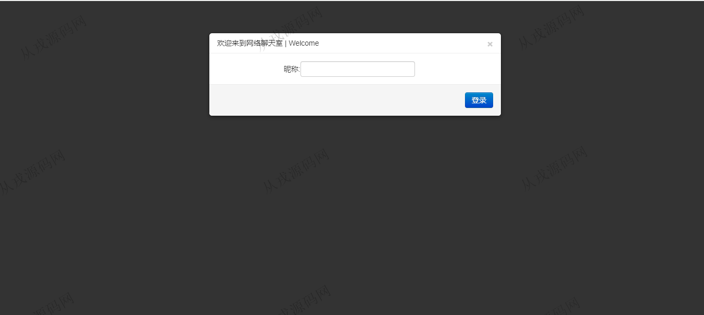
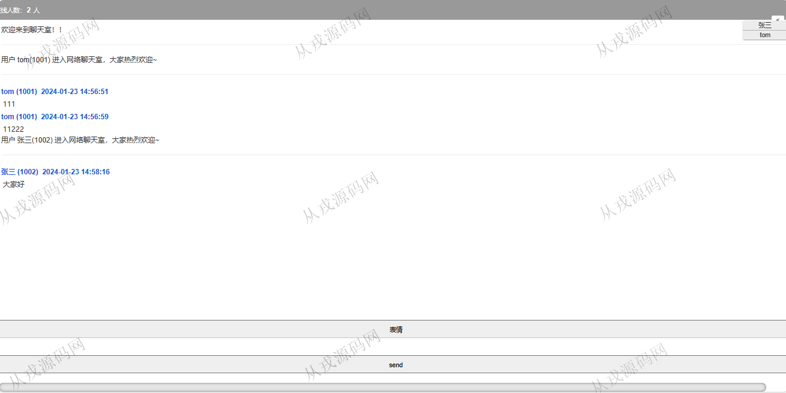
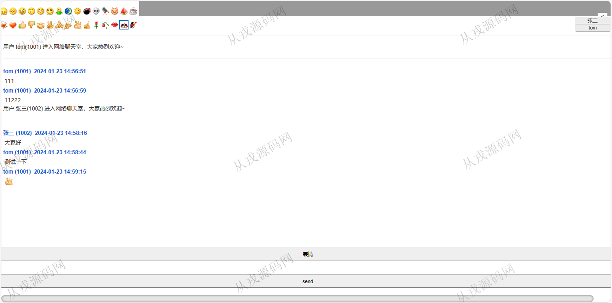

<h1 align="center">214.网络聊天室JavaWeb</h1>

- <b>完整代码获取地址：从戎源码网 ([https://armycodes.com/](https://armycodes.com/))</b>
- <b>技术探讨、资料分享，请加QQ群：692619798</b> 
- <b>作者微信：19941326836  QQ：952045282</b> 
- <b>承接计算机毕业设计、Java毕业设计、Python毕业设计、深度学习、机器学习</b>
- <b>选题+开题报告+任务书+程序定制+安装调试+论文+答辩ppt 一条龙服务</b>
- <b>所有选题地址 ([https://github.com/YuLin-Coder/AllProjectCatalog](https://github.com/YuLin-Coder/AllProjectCatalog)) </b>

## 项目介绍
基于JavaWeb的网络聊天室【含报告】：前端 html、jquery、WebSocket，后端 maven、netty；集成支持多人同时在线聊天等功能于一体的系统。

## 功能介绍

- 支持昵称登录：用户通过浏览器访问服务器时，需要确定自己的昵称，便于交流。

- 支持多人同时在线：聊天室支持多人登录而不轻易崩溃。由于Netty框架封装的高性能NIO特性，可以明显看到多用户同时在线时交流时的流畅性

- 同步显示在线人数和成员列表：聊天室支持多人登录，实时更新在线人数和列表，用户退出时即时发布广播消息

- 支持文字和表情的内容：聊天室支持在线用户发送文字与表情内容：

- 浏览器与服务器保持长连接，定时心跳检测

## 环境

- <b>IntelliJ IDEA 2021.3</b>

- <b>Tomcat 7.0.73</b>

- <b>JDK 1.8</b>

## 运行截图

